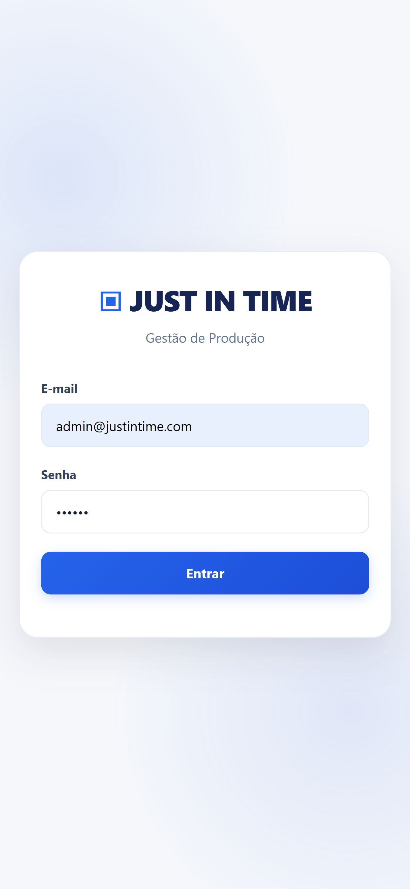
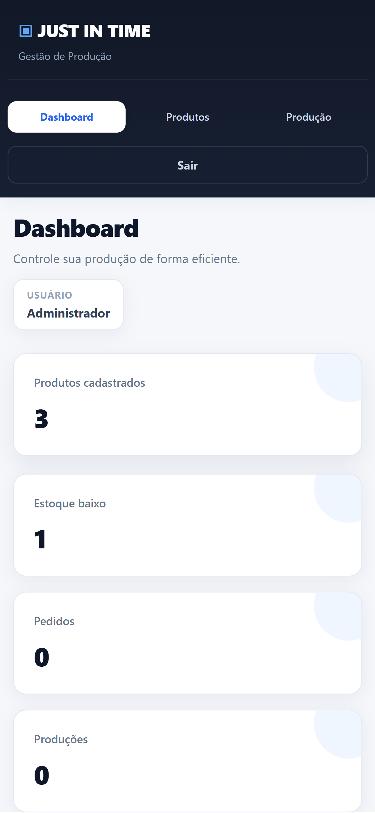
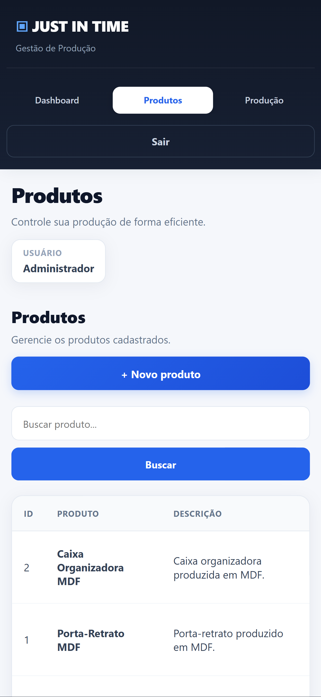
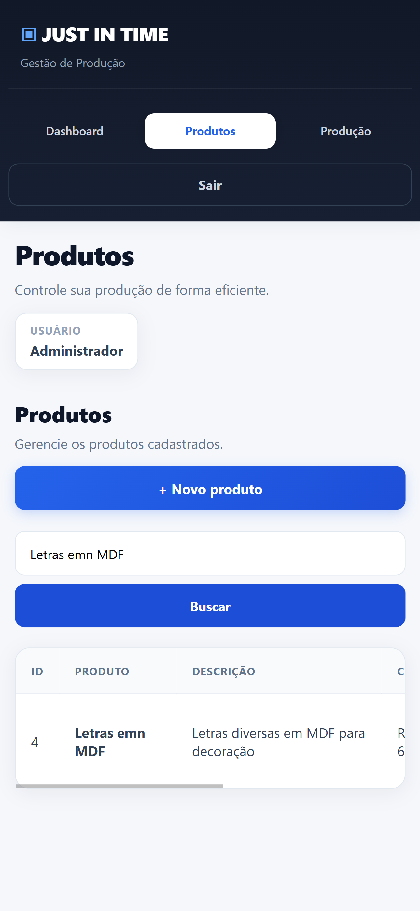
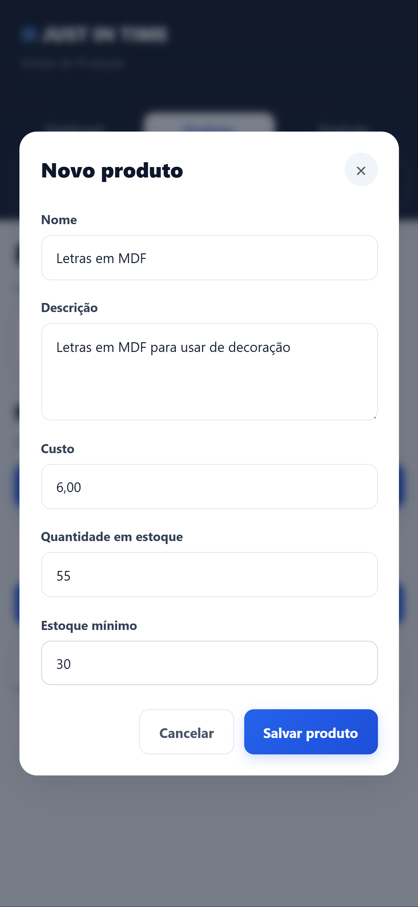
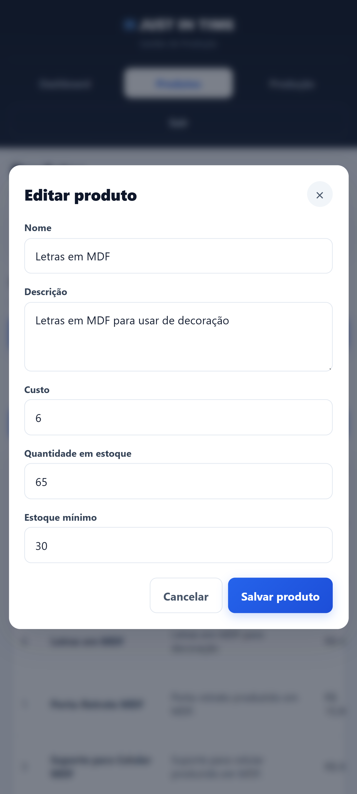
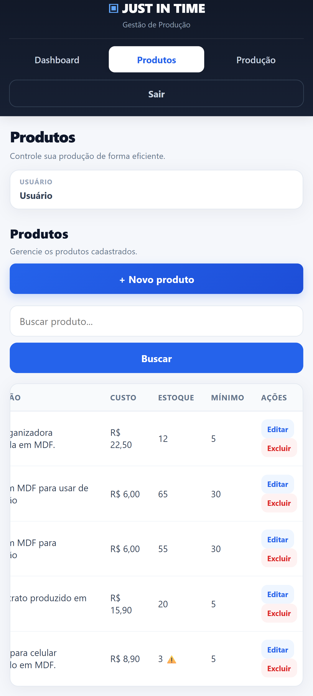
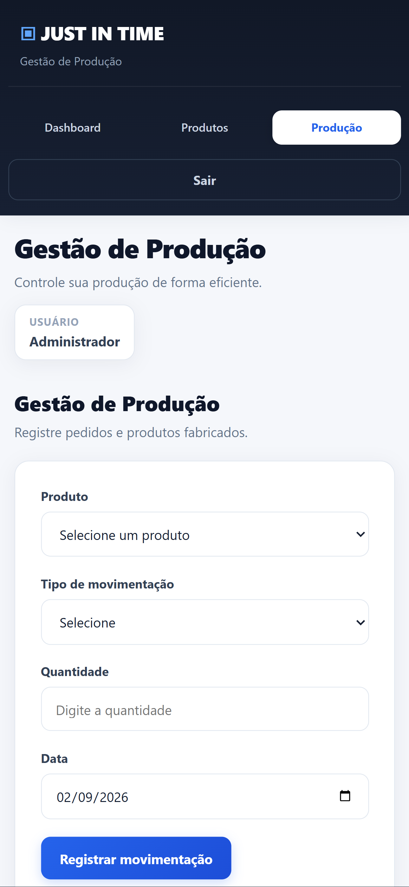
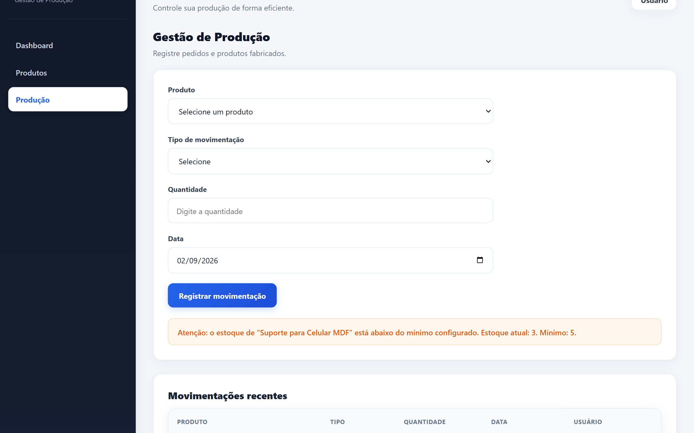

# DOCUMENTAÇÃO – SISTEMA JUST IN TIME

## 4. BANCO DE DADOS

O sistema utiliza o Prisma ORM para definir a estrutura do banco de dados. O banco utilizado possui o nome `preparacao_db`.

### Estrutura do banco

O banco de dados é composto por três entidades principais:

- **Usuario:** armazena os dados dos usuários do sistema.
- **Produto:** armazena as informações dos produtos, incluindo custo, quantidade em estoque e estoque mínimo.
- **Movimentacao:** registra as entradas e saídas de produtos, relacionando o produto movimentado e o usuário responsável.

### Schema Prisma

```prisma
generator client {
  provider = "prisma-client-js"
}

datasource db {
  provider = "mysql"
}

model Usuario {
  id             Int            @id @default(autoincrement())
  nome           String
  email          String         @unique
  senha          String
  movimentacoes  Movimentacao[]

  @@map("usuarios")
}

model Produto {
  id              Int            @id @default(autoincrement())
  nome            String
  descricao       String
  custo           Decimal        @db.Decimal(10, 2)
  quantidade      Int
  estoqueMinimo   Int

  movimentacoes   Movimentacao[]

  @@map("produtos")
}

model Movimentacao {
  id          Int      @id @default(autoincrement())
  tipo        String
  quantidade  Int
  data        DateTime

  produtoId   Int
  usuarioId   Int

  produto     Produto  @relation(fields: [produtoId], references: [id])
  usuario     Usuario  @relation(fields: [usuarioId], references: [id])

  @@map("movimentacoes")
}
```

---

## 8. DESCRITIVO DE TESTE DE SOFTWARE

### 8.1 Ferramentas e ambiente de testes

Os testes foram realizados com o objetivo de verificar o funcionamento das principais funcionalidades do sistema Just In Time, desde o acesso do usuário até o gerenciamento dos produtos e controle das movimentações de estoque.

### Ferramentas utilizadas

- **Visual Studio Code:** desenvolvimento e edição dos arquivos do sistema.
- **Google Chrome:** execução e testes da interface web.
- **Insomnia:** testes das requisições da API.
- **Node.js:** execução do servidor e do backend.
- **Prisma:** comunicação entre a aplicação e o banco de dados.
- **XAMPP:** execução do banco de dados MySQL/MariaDB.

### Ambiente de testes

Os testes foram realizados em ambiente local.

- Backend executado na porta `3000`.
- Banco de dados utilizado: `preparacao_db`.
- Interface executada pelo navegador Google Chrome.
- API testada através do Insomnia.
- Banco de dados executado utilizando o XAMPP.

---

## 8.2 Casos de teste

### CT01 – Autenticação

**Requisito funcional:** RF01

**Descrição:** Verificar o funcionamento da tela de login e a autenticação do usuário.

**Pré-condições:** O sistema deve estar iniciado e existir um usuário cadastrado.

**Passos:**

1. Acessar o sistema.
2. Informar o e-mail.
3. Informar a senha.
4. Clicar no botão de login.

**Resultado esperado:** O sistema deve validar os dados informados e permitir o acesso quando as credenciais estiverem corretas.

**Resultado obtido:** O login foi realizado corretamente e o usuário conseguiu acessar o sistema.

**Status:** Aprovado.

**Evidência:**



---

### CT02 – Tela principal

**Requisito funcional:** RF02

**Descrição:** Verificar a tela principal do sistema, a identificação do usuário e o acesso às funcionalidades.

**Pré-condições:** Usuário autenticado.

**Passos:**

1. Realizar o login.
2. Acessar o dashboard.
3. Verificar as informações apresentadas.
4. Verificar as opções disponíveis no sistema.

**Resultado esperado:** O sistema deve apresentar a tela principal, identificar o usuário logado e disponibilizar as funcionalidades do sistema.

**Resultado obtido:** A tela principal foi apresentada corretamente e o usuário conseguiu acessar as funcionalidades.

**Status:** Aprovado.

**Evidência:**



---

### CT03 – Gerenciamento de produtos

**Requisito funcional:** RF03

**Descrição:** Verificar as funcionalidades de listagem, pesquisa, cadastro, edição e exclusão de produtos.

**Pré-condições:** Usuário autenticado.

**Passos:**

1. Acessar a tela de produtos.
2. Verificar os produtos cadastrados.
3. Realizar uma pesquisa.
4. Cadastrar um novo produto.
5. Editar um produto.
6. Excluir um produto.

**Resultado esperado:** O sistema deve permitir consultar e realizar as operações de cadastro, pesquisa, edição e exclusão dos produtos.

**Resultado obtido:** As funcionalidades de gerenciamento de produtos foram executadas corretamente.

**Status:** Aprovado.

#### Listagem de produtos



#### Pesquisa



#### Cadastro



#### Edição



#### Edição e exclusão



---

### CT04 – Movimentação de estoque

**Requisito funcional:** RF04

**Descrição:** Verificar o registro de produtos fabricados e pedidos e a atualização do estoque.

**Pré-condições:** Existir um produto cadastrado e um usuário autenticado.

**Passos:**

1. Acessar a tela de movimentação.
2. Selecionar um produto.
3. Escolher o tipo de movimentação.
4. Informar a quantidade.
5. Informar a data.
6. Confirmar a movimentação.

**Resultado esperado:** O sistema deve registrar a movimentação e atualizar a quantidade em estoque de acordo com o tipo selecionado.

**Resultado obtido:** As movimentações foram registradas e o estoque foi atualizado corretamente.

**Status:** Aprovado.

**Evidência:**


---

### CT05 – Controle de estoque mínimo

**Requisito funcional:** RF04

**Descrição:** Verificar se o sistema identifica quando o estoque de um produto fica abaixo da quantidade mínima definida.

**Pré-condições:** O produto deve possuir um estoque mínimo cadastrado.

**Passos:**

1. Realizar uma movimentação de saída.
2. Reduzir a quantidade do produto.
3. Verificar a mensagem apresentada pelo sistema.

**Resultado esperado:** O sistema deve apresentar um alerta informando que o estoque está abaixo do mínimo.

**Resultado obtido:** O sistema apresentou o alerta de estoque mínimo corretamente.

**Status:** Aprovado.

**Evidência:**

O alerta é apresentado na tela de movimentação.


---

### CT06 – Estoque insuficiente

**Requisito funcional:** RF04

**Descrição:** Verificar se o sistema impede a realização de um pedido com quantidade superior ao estoque disponível.

**Pré-condições:** Existir um produto com quantidade limitada em estoque.

**Passos:**

1. Selecionar um produto.
2. Selecionar o tipo de movimentação "Pedido".
3. Informar uma quantidade superior à disponível.
4. Tentar confirmar a movimentação.

**Resultado esperado:** O sistema deve impedir a operação e informar que a quantidade disponível em estoque é insuficiente.

**Resultado obtido:** A operação foi bloqueada quando a quantidade solicitada era superior ao estoque disponível.

**Status:** Aprovado.

**Evidência:**

Teste realizado na tela de movimentação.


---

### CT07 – Registro e histórico das movimentações

**Requisito funcional:** RF04

**Descrição:** Verificar se as movimentações ficam armazenadas com as informações da operação realizada.

**Pré-condições:** Ter realizado pelo menos uma movimentação.

**Passos:**

1. Realizar uma movimentação.
2. Acessar a lista de movimentações.
3. Conferir as informações apresentadas.
4. Verificar o produto, tipo, quantidade, data e usuário responsável.

**Resultado esperado:** O sistema deve apresentar o histórico das movimentações com as informações correspondentes.

**Resultado obtido:** As movimentações foram registradas corretamente e as informações da operação foram apresentadas.

**Status:** Aprovado.

**Evidências:**





---

## Resumo dos testes

| ID | Funcionalidade | Resultado |
|---|---|---|
| CT01 | Autenticação | Aprovado |
| CT02 | Tela principal | Aprovado |
| CT03 | Gerenciamento de produtos | Aprovado |
| CT04 | Movimentação de estoque | Aprovado |
| CT05 | Controle de estoque mínimo | Aprovado |
| CT06 | Estoque insuficiente | Aprovado |
| CT07 | Registro das movimentações | Aprovado |

---

# 9. REQUISITOS DE INFRAESTRUTURA

## 9.1 Especificações utilizadas

### 9.1.1 Sistema Gerenciador de Banco de Dados

**SGBD:** MySQL/MariaDB

**Ferramenta utilizada:** XAMPP

**Banco de dados:** `preparacao_db`

O banco de dados é utilizado para armazenar as informações de usuários, produtos e movimentações do sistema.

---

### 9.1.2 Linguagens e tecnologias

**Linguagem de programação:** JavaScript

**Node.js:** 24.18.1

**Prisma:** 7.10.0

**Frontend:** HTML5, CSS3 e JavaScript

**Backend:** Node.js e Express

**Banco de dados:** MySQL/MariaDB

---

### 9.1.3 Sistema operacional

**Sistema operacional:** Windows

---

## 9.2 Ambiente necessário para execução

Para executar o sistema são necessários:

- Computador com sistema operacional Windows;
- Node.js instalado;
- XAMPP instalado;
- MySQL/MariaDB em execução;
- Navegador web atualizado;
- Banco de dados `preparacao_db`;
- Dependências do projeto instaladas.

### Inicialização do sistema

Primeiramente, deve-se iniciar o banco de dados pelo XAMPP.

Depois, acessar a pasta `backend` pelo terminal e executar:

```bash
node server.js
```

Em seguida, acessar a interface do sistema pelo navegador.